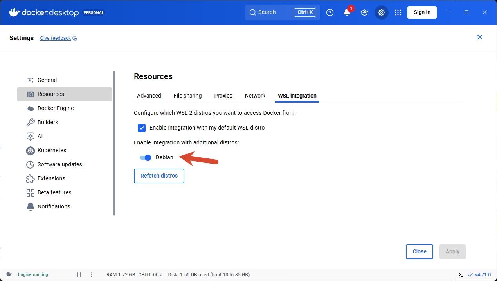

# WSL2 中 Docker 命令不可用

> 明明在 Windows 中安装了 Docker Desktop，但进入 WSL2 终端执行 `docker` 命令时提示 `bash: docker: command not found`。

## 问题表现

```bash
$ docker --version
bash: docker: command not found

$ which docker
/usr/bin/docker

$ ls -la /usr/bin/docker
lrwxrwxrwx 1 root root 48 May  2 19:09 /usr/bin/docker -> /mnt/wsl/docker-desktop/cli-tools/usr/bin/docker

$ ls /mnt/wsl/docker-desktop/
ls: cannot access '/mnt/wsl/docker-desktop/': No such file or directory
```

可以看到，即便 `/usr/bin/docker` 这个符号链接存在，它指向的目标路径 `/mnt/wsl/docker-desktop/cli-tools/usr/bin/docker` 却不存在，因为整个 `/mnt/wsl/docker-desktop/` 目录都没有被挂载。

而在 Windows 侧，Docker Desktop 本身是正常的：

```powershell
PS> docker.exe --version
Docker version 29.4.1, build 055a478
```

## 根因分析

`/mnt/wsl/docker-desktop/` 是 Docker Desktop 启用了 WSL Integration 后，通过 **9p 协议自动挂载**到 WSL2 发行版中的目录。该目录承载了 Docker CLI 工具和 docker.sock，使得在 WSL2 终端中可以直接使用 `docker` 命令。

如果这个目录不存在，说明 **Docker Desktop 没有为当前 WSL 发行版启用集成**。

| 检查项 | 状态 |
|--------|------|
| Docker Desktop (Windows) | ✅ 已安装，`docker.exe` 可用 |
| `/usr/bin/docker` | ✅ 符号链接存在 |
| `/mnt/wsl/docker-desktop/` | ❌ 目录不存在（集成未启用） |
| `/var/run/docker.sock` | ❌ 不存在 |

## 解决方案

### 1. 打开 Docker Desktop 设置

右键点击系统托盘 Docker 图标 → **Settings**，或打开 Docker Desktop 主界面后点击右上角齿轮图标。

### 2. 启用 WSL Integration

进入 **Resources** → **WSL Integration**：

1. 勾选 **"Enable integration with my default WSL distro"**
2. 在下方发行版列表中，**找到并勾选你正在使用的 Debian 发行版**
3. 点击右下角 **"Apply & restart"**



### 3. 等待重启完成

Docker Desktop 重启后，会自动挂载 `/mnt/wsl/docker-desktop/` 到勾选的 WSL 发行版。

### 4. 验证

```bash
$ docker --version
Docker version 29.4.1, build 055a478

$ docker run hello-world
Hello from Docker!
This message shows that your installation appears to be working correctly.
```

## 原理补充

Docker Desktop 使用一个轻量级的 WSL2 发行版作为后端来运行 Docker Engine，同时又通过 9p 文件系统将 CLI 工具"投射"到用户指定的 WSL 发行版中。这种设计的好处是：

- **Docker daemon 和 CLI 分离**：daemon 运行在专用的 `docker-desktop` 发行版中，用户无需在自己的开发发行版里安装 Docker Engine
- **自动挂载**：只需在设置中勾选，Docker CLI 和相关 socket 就会无缝出现在 `/mnt/wsl/docker-desktop/` 下
- **资源隔离**：容器不会污染用户的开发环境

因此，每当重装系统、新增 WSL 发行版、或 Docker Desktop 重置设置后，都需要**重新勾选 WSL Integration**，否则就会出现 `docker: command not found` 的问题。