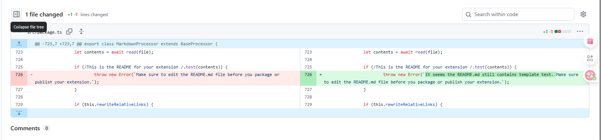

# VSCODE 插件开发第四课-打包
使用 `vsce` 打包

https://vscode.github.net.cn/api/working-with-extensions/publishing-extension


## 遇到的问题

1. 提示模板问题 README
   ```bash
    ERROR  It seems the README.md still contains template text. Make sure to edit the README.md file before you package or publish your extension.
   ```

https://github.com/microsoft/vscode-vsce/commit/7d1cc98c297f764fe15f2a189392c22c7242fabb



```typescript
// 就是根据第一句判断的，稍微改一个字符就能跳过
if (/This is the README for your extension /.test(contents)) {
```