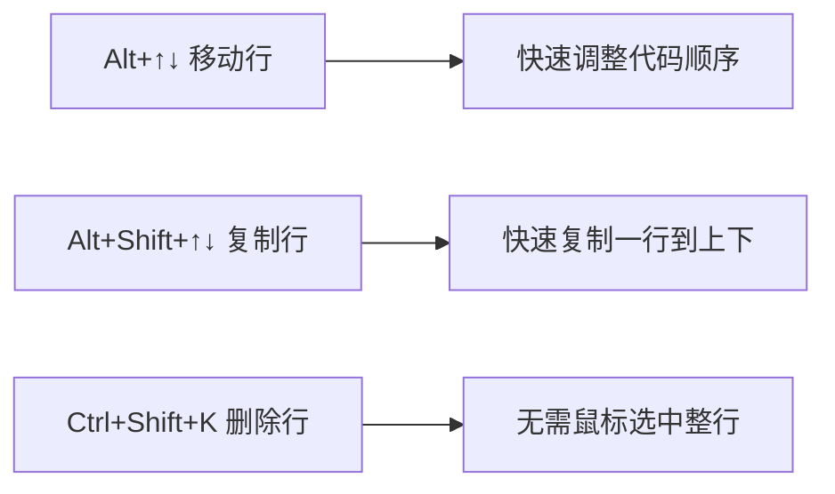
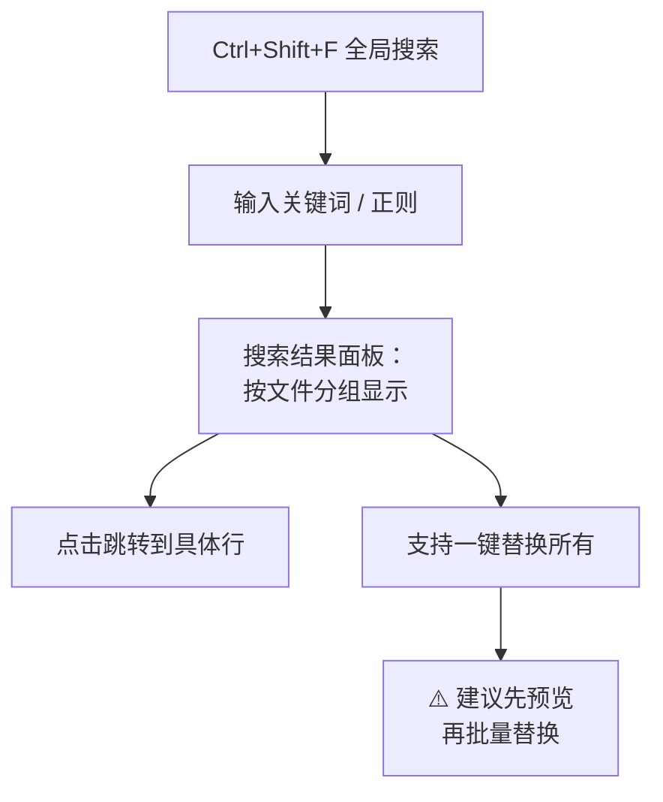
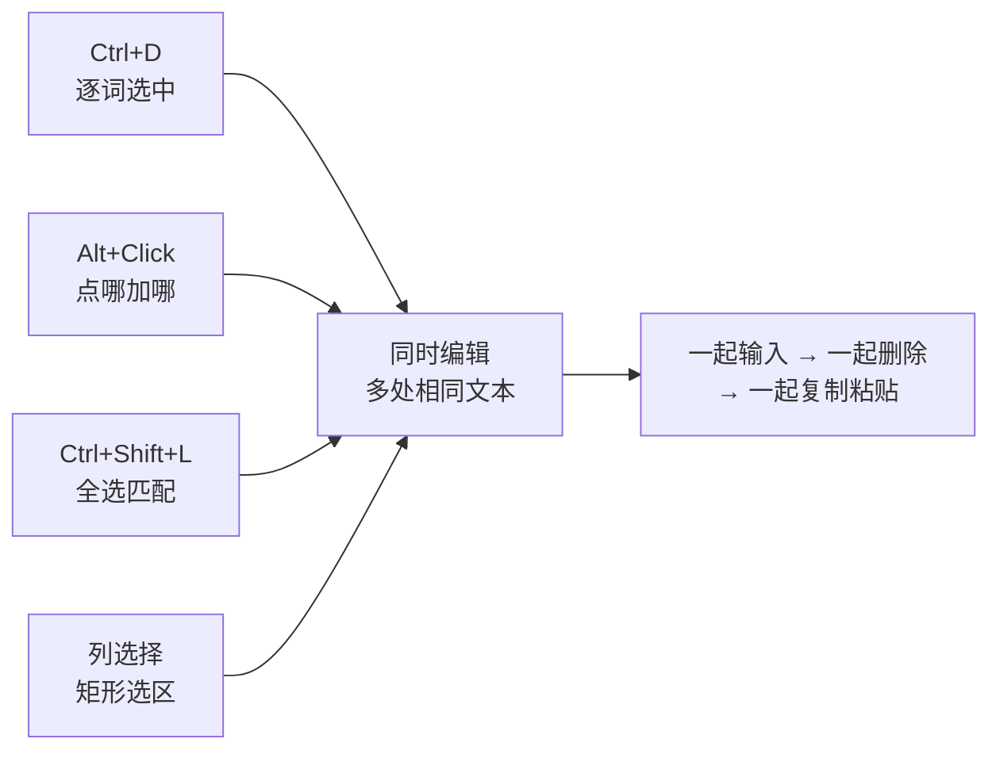

# VS Code 编辑器完全操作手册——高效编码必备技巧

> 本文聚焦 VS Code **编辑器本身**的使用技巧，从基础光标操作到正则替换、多光标编辑、终端使用，覆盖日常编码 90% 的场景。面向有基本使用经验、想提升效率的读者。

---

## 一、光标与选区——行云流水的第一步

### 1.1 基础光标移动

| 快捷键 | 功能 |
|--------|------|
| `←` `→` | 逐字符移动 |
| `Ctrl+←` `Ctrl+→` | 逐单词跳转 |
| `Home` | 跳到行首（缩进后第一个字符） |
| `End` | 跳到行尾 |
| `Ctrl+Home` | 跳到文件开头 |
| `Ctrl+End` | 跳到文件末尾 |
| `Ctrl+G` | 输入行号，跳转到指定行 |

### 1.2 选区操作

| 快捷键 | 功能 |
|--------|------|
| `Shift + 方向键` | 扩展选区 |
| `Ctrl+Shift+←` `Ctrl+Shift+→` | 按单词扩展选区 |
| `Ctrl+L` | 选中当前行（连续按选中下一行） |
| `Ctrl+D` | 选中当前单词，再按选中下一个相同单词 |
| `Ctrl+Shift+L` | 选中文件中**所有**相同的单词 |
| `Alt+Shift+→` | 智能扩展选区（逐步扩大） |
| `Alt+Shift+←` | 智能缩小选区 |

### 1.3 行操作

| 快捷键 | 功能 |
|--------|------|
| `Alt+↑` `Alt+↓` | 将当前行上移/下移 |
| `Alt+Shift+↑` `Alt+Shift+↓` | 向上/向下复制当前行 |
| `Ctrl+Shift+K` | 删除当前行 |
| `Ctrl+Enter` | 在当前行下方插入空行 |
| `Ctrl+Shift+Enter` | 在当前行上方插入空行 |
| `Ctrl+/` | 注释/取消注释当前行 |
| `Ctrl+[` `Ctrl+]` | 减少/增加缩进 |



---

## 二、查找与替换——精准操控文本

### 2.1 基础查找

| 快捷键 | 功能 |
|--------|------|
| `Ctrl+F` | 在当前文件中查找 |
| `Ctrl+H` | 查找并替换 |
| `F3` / `Shift+F3` | 查找下一个 / 上一个 |
| `Enter` | 查找下一个（焦点在查找框时） |

### 2.2 高级查找选项

打开查找框（`Ctrl+F`）后，右侧有一排切换按钮：

```
┌─────────────────────────────────────────────────┐
│ 🔍 查找内容...                    [Aa] [Ab] [.*] │
├─────────────────────────────────────────────────┤
│  [Aa]  区分大小写 (Match Case)                   │
│  [Ab]  全字匹配 (Match Whole Word)               │
│  [.*]  使用正则表达式 (Use Regex)                │
│  [📁]  在文件中查找 (Search in Files)            │
│  [···] 更多选项                                  │
└─────────────────────────────────────────────────┘
```

### 2.3 正则表达式查找替换实战

这是 VS Code 最强大的文本处理功能。

**开启方式：** 查找框中点击 `[.*]` 按钮，或 `Alt+R`。

#### 常用正则速查

| 正则 | 含义 | 匹配示例 |
|------|------|----------|
| `\d` | 数字 | `1`, `9` |
| `\d+` | 一个或多个数字 | `123`, `2026` |
| `\w` | 单词字符（字母数字下划线） | `a`, `_name` |
| `\s` | 空白字符 | 空格、Tab、换行 |
| `.` | 任意字符 | `a`, `1`, `中` |
| `.*` | 任意字符，任意次数 | 整行 |
| `^` | 行首 | |
| `$` | 行尾 | |
| `[abc]` | 字符组 | `a` 或 `b` 或 `c` |
| `[^abc]` | 排除字符组 | 不是 a/b/c |
| `(group)` | 捕获组 | 用 `$1` 引用 |

#### 实战场景

**场景 1：给所有行首加前缀**

```
查找：^
替换：INSERT INTO
→ 每行开头加上 INSERT INTO
```

**场景 2：SQL 字段名批量加反引号**

```
查找：(\w+)
替换：`$1`
→ 所有单词都被包上反引号
```

**场景 3：交换两列位置**

```
原始：col_a, col_b
查找：(\w+), (\w+)
替换：$2, $1
→ 变成 col_b, col_a
```

**场景 4：删除行尾空白**

```
查找：\s+$
替换：（空）
→ 清除所有行尾多余空格
```

**场景 5：格式化日期**

```
原始：2026-07-11
查找：(\d{4})-(\d{2})-(\d{2})
替换：$1年$2月$3日
→ 2026年07月11日
```

> 💡 **小技巧：** 在替换框中，`$1`、`$2` 等引用捕获组。`$&` 引用完整匹配，`$`` 引用匹配前文本，`$'` 引用匹配后文本。

### 2.4 跨文件查找替换

| 快捷键 | 功能 |
|--------|------|
| `Ctrl+Shift+F` | 在所有文件中查找 |
| `Ctrl+Shift+H` | 在所有文件中查找并替换 |

结果会显示在左侧搜索结果面板，点击可跳转到对应文件和行。



---

## 三、多光标编辑——批量操作的终极武器

### 3.1 添加多光标

| 快捷键 | 功能 |
|--------|------|
| `Alt+Click` | 在点击位置添加光标 |
| `Ctrl+Alt+↑` `Ctrl+Alt+↓` | 在上方/下方添加光标 |
| `Ctrl+D` | 选中当前单词，再按添加下一个相同单词的光标 |
| `Ctrl+Shift+L` | 选中文件中**所有**相同单词，每处一个光标 |
| `Ctrl+F2` | 同 `Ctrl+Shift+L`，选中所有匹配项 |

### 3.2 列选择（矩形选区）

| 快捷键 | 功能 |
|--------|------|
| `Alt+Shift+拖动鼠标` | 列选择模式（矩形选区） |
| `Ctrl+Alt+Shift+↑↓` | 键盘列选择 |

**典型场景：** 多行文本每行前面插入相同内容

```
原始：            列选择后同时输入：
SELECT            -- SELECT
FROM              -- FROM
WHERE             -- WHERE
```

### 3.3 实战组合技



#### 实战示例

**给多行 SQL 字段加别名：**

```sql
-- 原始
SELECT
    order_id
    order_amount
    order_time

-- 操作：Alt+Shift+拖动选中后三行行尾，输入别名
SELECT
    order_id       AS id,
    order_amount   AS amount,
    order_time     AS dt
```

> 💡 **核心思想：** 多光标的本质是"一次操作，多处生效"。当你发现自己在重复做同一件事时，想想有没有多光标方案。

---

## 四、终端命令行——不出编辑器的 Shell

### 4.1 打开终端

| 快捷键 | 功能 |
|--------|------|
| `` Ctrl+` `` | 打开/关闭集成终端 |
| `Ctrl+Shift+` ` `` | 新建终端 |
| `Ctrl+Shift+5` | 拆分终端（左右分屏） |

### 4.2 终端管理

```
┌─────────────────────────────────────────┐
│ 终端标签栏                                │
│ [bash] [node] [git]  [+] [🗑] [📊] [✕]   │
├─────────────────────────────────────────┤
│ （终端面板，可自由拖拽调整高度）              │
│ $ ls                                     │
│ $ npm run dev                            │
│                                          │
└─────────────────────────────────────────┘
```

| 操作 | 方式 |
|------|------|
| 切换终端 | 点击标签，或下拉菜单选择 |
| 重命名终端 | 右键标签 → Rename |
| 改变颜色 | 右键标签 → Change Color |
| 拆分终端 | 点击右上角 `📊` |
| 关闭终端 | 点击 `🗑` 或输入 `exit` |
| 最大化终端 | 点击右上角 `↑` |
| 移动到编辑器区 | 右键 → Move Terminal into Editor Area |

### 4.3 终端快捷键

| 快捷键 | 功能 |
|--------|------|
| `Ctrl+C` | 终止当前命令 |
| `Ctrl+L` | 清屏 |
| `Ctrl+PageUp/Down` | 切换终端标签 |
| `↑` `↓` | 历史命令 |
| `Ctrl+R` | 搜索历史命令 |
| `Tab` | 自动补全路径/命令 |

### 4.4 终端运行选中代码

在编辑器中选中一段代码 → 右键 → `Run in Terminal`（或 `Ctrl+Shift+P` → `Terminal: Run Selected Text`），直接将选中内容发送到终端执行。

---

## 五、集成浏览器——在 VS Code 里预览页面

### 5.1 简单预览

| 方式 | 说明 |
|------|------|
| **Simple Browser** | 内置命令，打开任意 URL |
| `Ctrl+Shift+P` → `Simple Browser: Show` | 输入 URL 即可预览 |

### 5.2 Live Preview（推荐安装）

从扩展商店安装 **Live Preview**（微软官方出品），支持：

- 右键 HTML 文件 → `Show Preview`，侧边实时预览
- 内嵌浏览器支持 DevTools
- 自动刷新

### 5.3 浏览器快捷键

| 快捷键 | 功能 |
|--------|------|
| `Ctrl+Shift+P` → `Simple Browser: Show` | 打开浏览器面板 |
| 浏览器面板中 `Ctrl+R` | 刷新 |
| 浏览器面板中 `F12` | 打开 DevTools（需 Live Preview） |

---

## 六、代码导航——在文件间穿梭

### 6.1 跳转操作

| 快捷键 | 功能 |
|--------|------|
| `Ctrl+P` | 快速打开文件（输入文件名即可搜索） |
| `Ctrl+Shift+O` | 跳转到当前文件的符号（函数、变量等） |
| `Ctrl+T` | 全局搜索符号 |
| `F12` | 跳转到定义 |
| `Alt+F12` | 查看定义（浮窗预览，不跳转） |
| `Ctrl+F12` | 跳转到实现 |
| `Shift+F12` | 查看所有引用 |
| `Alt+←` `Alt+→` | 后退 / 前进（导航历史） |

### 6.2 面包屑导航

编辑器顶部显示当前文件的路径层级：

```
> docs > learn > VSCodeEx > 2026-07-11-vscode-editor-guide.md
                 ^点击可跳转到目录
```

`Ctrl+Shift+.` 聚焦面包屑，用方向键选择并跳转。

### 6.3 大纲视图

左侧边栏 → **大纲 (Outline)**，显示当前文件的结构：

```
┌── 大纲 ──────────────────┐
│  # 一、光标与选区          │
│  ## 1.1 基础光标移动      │
│  ## 1.2 选区操作          │
│  # 二、查找与替换          │
│  ## 2.1 基础查找          │
│  ...                      │
└──────────────────────────┘
```

点击任意标题即可跳转。

---

## 七、括号与配对——告别括号迷失

### 7.1 括号颜色配对

VS Code 内置 **Bracket Pair Colorization**，不同层级的括号用不同颜色：

```sql
SELECT * FROM (          -- 金色 (
  SELECT * FROM [        -- 紫色 [
    SELECT * FROM {      -- 蓝色 {
      col = 'value'      -- 绿色 ' '
    }                    -- 蓝色 }
  ]                      -- 紫色 ]
)                        -- 金色 )
```

颜色让嵌套层级一目了然，再也不用数括号了。

### 7.2 括号操作

| 快捷键 | 功能 |
|--------|------|
| `Ctrl+Shift+\` | 跳转到配对的括号 |
| 鼠标悬停在括号上 | 高亮显示配对括号 |
| 双击选中 `{` 内部 | `Ctrl+Shift+→` 智能扩展 |

### 7.3 折叠代码

| 快捷键 | 功能 |
|--------|------|
| `Ctrl+Shift+[` | 折叠当前代码块 |
| `Ctrl+Shift+]` | 展开当前代码块 |
| `Ctrl+K Ctrl+0` | 折叠所有 |
| `Ctrl+K Ctrl+J` | 展开所有 |
| `Ctrl+K Ctrl+/` | 折叠所有注释 |

---

## 八、文件与编辑器管理

### 8.1 编辑器分屏

| 快捷键 | 功能 |
|--------|------|
| `Ctrl+\` | 向右拆分编辑器 |
| `Ctrl+1/2/3` | 聚焦第 1/2/3 个编辑器组 |
| `Ctrl+K Ctrl+←` `Ctrl+K Ctrl+→` | 聚焦左/右编辑器组 |

### 8.2 快速切换

| 快捷键 | 功能 |
|--------|------|
| `Ctrl+Tab` | 按最近使用顺序切换文件 |
| `Ctrl+PageUp/Down` | 切换上一个/下一个文件 |
| `Ctrl+W` | 关闭当前文件 |
| `Ctrl+K Ctrl+W` | 关闭所有文件 |
| `Ctrl+K F` | 关闭文件夹 |

### 8.3 资源管理器

| 快捷键 | 功能 |
|--------|------|
| `Ctrl+Shift+E` | 聚焦资源管理器 |
| `F2` | 重命名文件（在资源管理器中选中后） |
| `Ctrl+Enter` | 在资源管理器中打开文件（保持焦点） |
| `Ctrl+N` | 新建文件 |
| `Ctrl+K Ctrl+N` | 新建文件（在资源管理器焦点时） |

---

## 九、常用设置优化

按 `Ctrl+,` 打开设置，搜索以下配置项：

| 设置项 | 推荐值 | 说明 |
|--------|--------|------|
| `Editor: Font Size` | `14-16` | 编辑器字体大小 |
| `Editor: Tab Size` | `2` 或 `4` | Tab 缩进空格数 |
| `Editor: Word Wrap` | `on` | 自动换行，避免横向滚动 |
| `Editor: Minimap` | `true/false` | 右侧代码缩略图 |
| `Editor: Render Whitespace` | `boundary` | 显示空格/Tab 标记 |
| `Editor: Bracket Pair Colorization` | `true` | 括号配色（默认开启） |
| `Editor: Cursor Blinking` | `smooth` | 光标闪烁样式 |
| `Editor: Cursor Smooth Caret Animation` | `on` | 光标平滑移动 |
| `Workbench: Color Theme` | - | 主题色 |
| `Terminal › Integrated: Font Size` | `13-14` | 终端字体大小 |

---

## 十、推荐插件清单

| 插件 | 用途 |
|------|------|
| **GitLens** | Git 增强：行内 Blame、提交图谱 |
| **Prettier** | 代码格式化 |
| **Live Preview** | 内置浏览器预览 |
| **SQL Tools** | SQL 连接、执行、格式化 |
| **Rainbow CSV** | CSV 文件列颜色标记 |
| **Todo Tree** | 收集 TODO/FIXME 标记 |
| **Error Lens** | 行内显示错误和警告 |
| **indent-rainbow** | 缩进彩虹线 |

---

## 十一、命令面板——万能入口

`Ctrl+Shift+P`（或 `F1`）打开命令面板，一切操作都可以从这里搜索：


**常用命令：**

| 搜索关键词 | 功能 |
|-----------|------|
| `theme` | 切换主题 |
| `keyboard` | 查看/修改快捷键 |
| `settings` | 打开设置 |
| `reload` | 重载窗口 |
| `format` | 格式化文档 |
| `fold` | 折叠代码 |
| `toggle minimap` | 开关缩略图 |
| `toggle word wrap` | 开关自动换行 |

---

## 十二、快捷键速查表

| 类别 | 操作 | 快捷键 |
|------|------|--------|
| **查找** | 文件内查找 | `Ctrl+F` |
| | 替换 | `Ctrl+H` |
| | 全局搜索 | `Ctrl+Shift+F` |
| **光标** | 跳转到行 | `Ctrl+G` |
| | 多光标（上下） | `Ctrl+Alt+↑↓` |
| | 选中所有匹配 | `Ctrl+Shift+L` |
| | 列选择 | `Alt+Shift+拖拽` |
| **导航** | 打开文件 | `Ctrl+P` |
| | 跳转符号 | `Ctrl+Shift+O` |
| | 跳转定义 | `F12` |
| | 前进/后退 | `Alt+←→` |
| **编辑** | 移动行 | `Alt+↑↓` |
| | 复制行 | `Alt+Shift+↑↓` |
| | 删除行 | `Ctrl+Shift+K` |
| | 注释 | `Ctrl+/` |
| | 格式化 | `Alt+Shift+F` |
| **终端** | 打开终端 | `` Ctrl+` `` |
| | 新建终端 | `` Ctrl+Shift+` `` |
| **窗口** | 分屏 | `Ctrl+\` |
| | 切换文件 | `Ctrl+Tab` |
| | 关闭文件 | `Ctrl+W` |
| | 命令面板 | `Ctrl+Shift+P` |

---

## 十三、总结

三个最重要的习惯：

1. **`Ctrl+Shift+P` 是你的万能钥匙**——不记得快捷键就搜命令
2. **多光标是效率翻倍的核心**——`Ctrl+D`、`Alt+Click`、`Ctrl+Shift+L` 练熟了，批量操作分分钟搞定
3. **正则替换是文本处理的终极武器**——花 10 分钟学会 `$1` 捕获组，受益终身
