# VS Code Git 完全操作手册——ETL 脚本仓库实战

> 本文面向**零基础**读者，无需任何 Git 或 VS Code 经验。所有示例和场景均基于 **ETL SQL 脚本仓库**的实际工作流，从概念到发版，每一步都有流程图和截图说明，跟着操作即可上手。

---

## 一、先搞懂基础概念

### 1.1 什么是版本控制？

假设你在维护一堆 ETL 脚本：

```
数据源A_增量抽取_v1.sql
数据源A_增量抽取_v2_修复日期格式.sql
数据源A_增量抽取_v3_最终版.sql
数据源A_增量抽取_v4_真最终.sql
数据源A_增量抽取_v5_打死不改.sql
```

这就是最原始的"版本控制"——手动备份。而 **Git** 自动记录每次修改历史，你可以随时回到任意版本，还能看到谁在什么时候改了什么。

### 1.2 Git 的三个区域

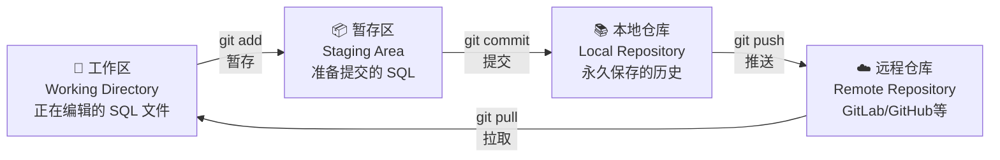

> **通俗理解：**
> - **工作区** = 你的书桌，正在写的 SQL 脚本
> - **暂存区** = 购物车，确认要提交的脚本
> - **本地仓库** = 家里的保险柜，永久保存
> - **远程仓库** = 公司服务器，云端备份 + 团队共享

### 1.3 什么是分支（Branch）？

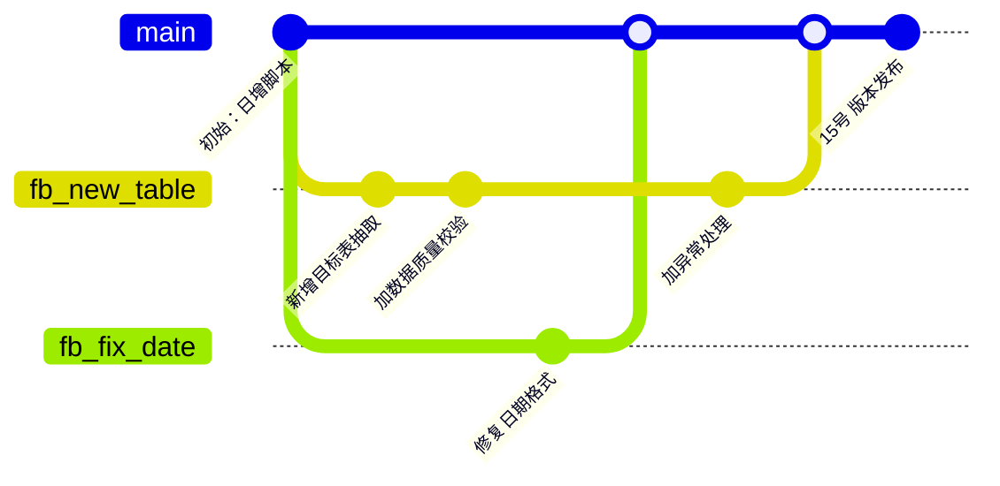

分支就像不同的工作台——从 `master` 分出 `fb_new_table` 去开发新表抽取，分出 `fb_fix_date` 去修复日期问题。两边互不影响，开发完再合并。

| 术语 | ETL 仓库中的含义 |
|------|-----------------|
| `master` | 生产环境正在运行的脚本，**只在版本发布日更新** |
| `fb_xxx` | 功能分支，命名如 `fb_new_cust_sync`，从 master 检出 |
| `dev` | 代码审查分支，fb_xxx 通过 PR 合入，用于 Code Review |
| `uat` | UAT 测试分支，由发版人从 dev 部署，测试人员在此验证 |
| `release` | 准生产分支，uat 测试全部通过后合入到这里 |
| `HEAD` | 指针，指向你当前所在的分支/提交 |

---

## 二、VS Code 中的 Git 界面速览

打开 VS Code，左侧活动栏点击 **源代码管理** 图标，快捷键 `Ctrl+Shift+G`。

```
┌─────────────────────────────────────────┐
│  源代码管理 (Ctrl+Shift+G)               │
├─────────────────────────────────────────┤
│  🔍 Message (Ctrl+Enter 提交)            │  ← 写提交信息
├─────────────────────────────────────────┤
│  暂存的更改 (Staged Changes)             │  ← 即将提交的 SQL
│  ├─ M  dwd_order_inc.sql                │
│  └─ A  dws_cust_sum.sql                 │
├─────────────────────────────────────────┤
│  更改 (Changes)                         │  ← 已修改未暂存
│  ├─ M  dim_date.sql                     │
│  └─ U  dwd_new_table.sql                │
├─────────────────────────────────────────┤
│  ⋮  更多操作菜单                         │
│  ↕️  拉取/推送                           │
│  🔀 fb_new_cust  ← 当前分支名            │
└─────────────────────────────────────────┘
```

**文件状态标记：**

| 标记 | 含义 | 示例 |
|------|------|------|
| `M` | 已修改 | 改了 `dim_date.sql` 的过滤条件 |
| `A` | 新添加 | 新建了 `dws_cust_sum.sql` |
| `D` | 已删除 | 删除了废弃的旧脚本 |
| `U` | 未跟踪 | 新文件还没被 Git 管理 |
| `C` | 有冲突 | 两人改了同一个 SQL |

---

## 三、仓库分支模型——本仓库核心流程

> **这是最重要的章节。** 理解分支模型，后面的操作才有意义。

### 3.1 分支全景图

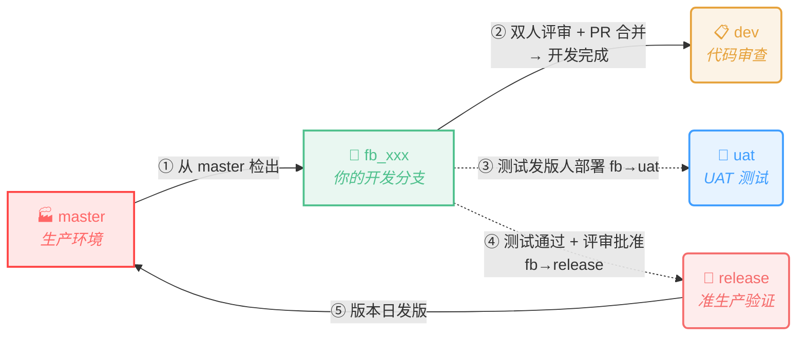

### 3.2 各分支职责

| 分支 | 用途 | 谁操作 | 更新时机 |
|------|------|--------|----------|
| `master` | 生产运行脚本 | 发版负责人 | **仅在版本日**（15/24/29）|
| `dev` | 代码审查，fb_xxx 通过 PR 合入 | 开发者提 PR | 日常，每个 fb_xxx 完成就合入 |
| `uat` | UAT 测试分支，测试发版人将 fb_xxx 合并到此，测试人员验证 | 测试发版人部署、测试人验证 | 每次测试发版人部署时更新 |
| `release` | 准生产，fb_xxx 测试通过 + 发版评审批准后合入 | 发版负责人 | 版本日前 1-2 天 |
| `fb_xxx` | 你的开发分支 | 你 | 从 master 检出，开发完提交 PR 到 dev |

### 3.3 版本窗口机制

本仓库采用**固定版本窗口**发版，每月有三个生产发版日：

```
┌──────────┬──────────┬──────────┬──────────┐
│  15日    │  24日    │  29日    │  下月15日 │
│  版本窗口1 │  版本窗口2 │  版本窗口3 │  ...     │
└──────────┴──────────┴──────────┴──────────┘
     ↑          ↑          ↑
  生产发版    生产发版    生产发版
```

**关键规则：**

1. **master 在非版本日锁定不动**——生产环境稳定第一
2. 一个版本窗口内，可能有多个 `fb_xxx` 在并行开发
3. 开发完成 = 双人代码评审通过后，提交 PR 将 `fb_xxx` 合并到 `dev`
4. 测试发版人将 `fb_xxx` 合并到 `uat` 分支，测试人员在 `uat` 上验证
5. UAT 测试通过 **且** 发版评审批准后，发版负责人将 `fb_xxx` 合入 `release`（准生产）
6. 生产发版人员在版本日当天，将 `release` → `master`，完成发版，新一轮开发开始

### 3.4 完整开发到发版流程

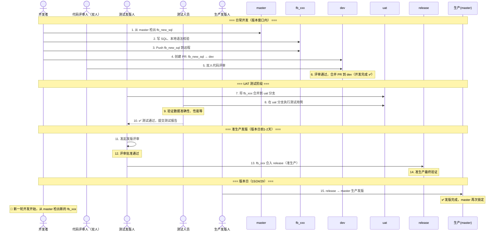

---

## 四、第一步：克隆项目到本地

### 4.1 从 GitLab / GitHub 克隆

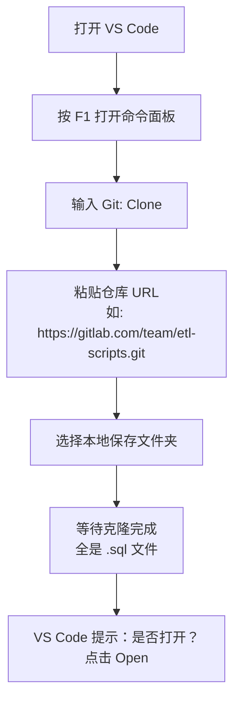

**操作步骤：**

1. 按 `F1`（或 `Ctrl+Shift+P`）打开命令面板
2. 输入 `Git: Clone`，选中该命令
3. 粘贴仓库的 HTTPS URL（从 GitLab 仓库页面复制）
4. 选择一个本地文件夹
5. 克隆完成后，点击右下角 **"Open"** 打开项目

---

## 五、日常开发全流程

### 5.1 完整工作流

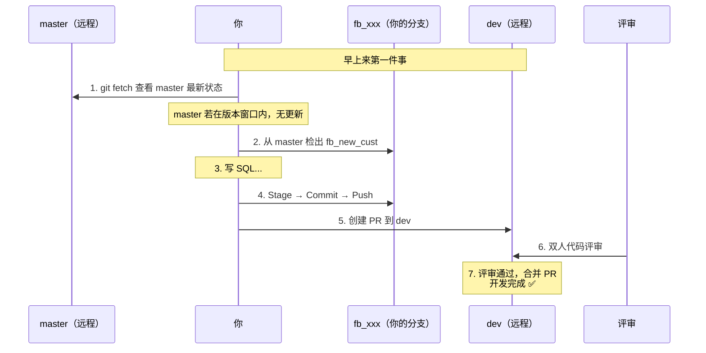

### 5.2 创建开发分支

**重要：** 始终从 `master` 检出，而不是从 `dev`！确保脚本基线是生产版本。

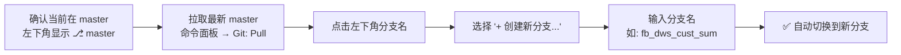

**分支命名规范：**

| 前缀 | 含义 | 示例 |
|------|------|------|
| `fb_` | 功能开发 | `fb_dws_cust_sum`（客户汇总表）|
| `fb_fix_` | Bug 修复 | `fb_fix_date_format`（修复日期格式）|
| `fb_opt_` | 性能优化 | `fb_opt_query_index`（优化查询索引）|

> 💡 命名用下划线分隔，简洁明了。不要用 `fb_xxx`、`fb_test` 这种无意义的名字。

### 5.3 暂存修改（Stage）

在源代码管理面板的 **"更改"** 区域：

- **暂存单个 SQL 文件：** 鼠标悬停在文件上，点击 `+`
- **暂存全部：** 点击 "更改" 行右侧的 `+`
- **取消暂存：** 在 "暂存的更改" 区域点 `-`

### 5.4 提交（Commit）——写好提交信息

提交信息规范（本仓库专用）：

```
<类型>: <层级> - <简短描述>

<详细说明（可选）>
```

| 类型 | 示例 |
|------|------|
| `feat` | `feat: dws层 - 新增客户月度汇总脚本` |
| `fix` | `fix: dim层 - 修复日期字段格式转换错误` |
| `opt` | `opt: dwd层 - 优化订单表增量抽取性能` |
| `docs` | `docs: 更新数据字典 dws_cust_sum 字段说明` |

**好的示例：**

```
feat: dws层 - 新增客户30日留存统计脚本

- 数据源：dwd_order_inc + dim_cust
- 目标表：dws_cust_retention_30d
- 调度依赖：需在 dwd_order_inc 完成后执行
```

1. 在 Message 输入框填写提交信息
2. 按 `Ctrl+Enter` 提交

### 5.5 推送到远程（Push）

| 方式 | 操作 |
|------|------|
| **底部状态栏** | 点击 `↕️` 同步按钮 |
| **命令面板** | `Ctrl+Shift+P` → `Git: Push` |

> ⚠️ **Push 前确认：** 你推的是 `fb_xxx` 分支，不是 `master`！看左下角分支名确认。

---

## 六、Pull Request——从 fb_xxx 到 dev

### 6.1 PR 流程

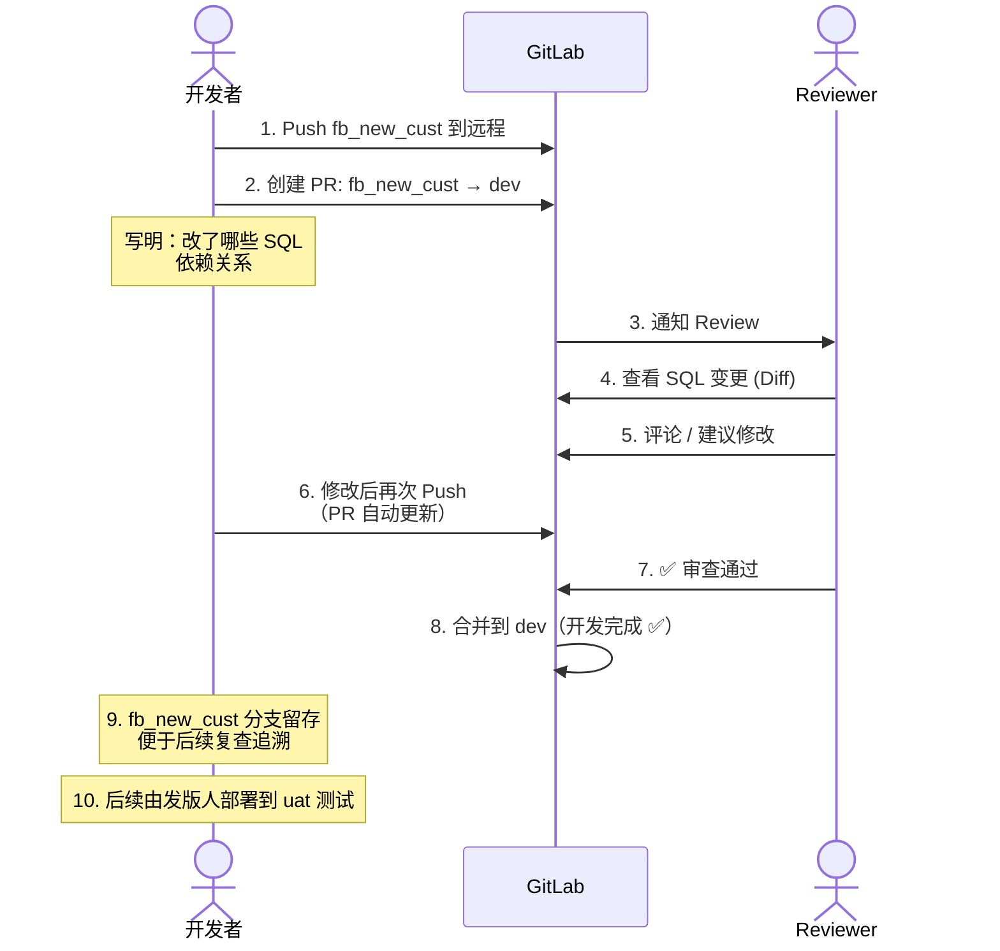

### 6.2 PR 描述模板

在 GitLab 创建 PR 时，按以下模板填写：

```markdown
## 变更说明
- 新增 dws_cust_sum.sql：客户月度汇总
- 修改 dim_date.sql：增加农历日期字段

## 依赖关系
- 依赖 dwd_order_inc 先执行
- 无上下游影响

## 测试情况
- [x] 本地语法校验通过
- [x] UAT 环境数据量 100w 行测试通过
- [x] UAT 全量数据验证通过

## 上线检查项
- [ ] 目标表已建
- [ ] 调度配置已更新
- [ ] 数据质量监控已添加
```

### 6.3 PR 与本地 Merge 的区别

| 对比维度 | 本地 Merge | Pull Request |
|----------|-----------|--------------|
| **操作位置** | VS Code 本地 | GitLab 网页 |
| **代码审查** | 无 | 同事 Review、行级评论 |
| **合并目标** | 任意分支 | 本仓库固定 `fb_xxx → dev` |
| **CI 触发** | 无 | PR 合入 dev 后，由发版人部署 uat 进行测试 |
| **可追溯** | 仅提交记录 | PR 页面永久保存讨论 |

> 🔑 **核心区别：** 在本仓库，你**永远**不直接在本地 merge 到 `dev`。所有合并都通过 GitLab PR，有人 Review 后才能合。

---

## 七、发版流程——版本窗口机制详解

### 7.1 版本窗口全景

```mermaid
gantt
    title 每月版本窗口与发版节奏
    dateFormat  DD
    axisFormat  %d日
    
    section 版本窗口1
    日常开发 fb_xxx→dev    :a1, 01, 13d
    fb→release 合入        :a2, 13, 2d
    准生产验证             :a3, 14, 1d
    生产发版 release→master :milestone, a4, 15, 1d
    
    section 版本窗口2
    日常开发 fb_xxx→dev    :b1, 16, 7d
    fb→release 合入        :b2, 23, 1d
    准生产验证             :b3, 24, 1d
    生产发版 release→master :milestone, b4, 24, 1d
    
    section 版本窗口3
    日常开发 fb_xxx→dev    :c1, 25, 3d
    fb→release 合入        :c2, 28, 1d
    准生产验证             :c3, 29, 1d
    生产发版 release→master :milestone, c4, 29, 1d
```

### 7.2 发版日操作（由发版负责人执行）

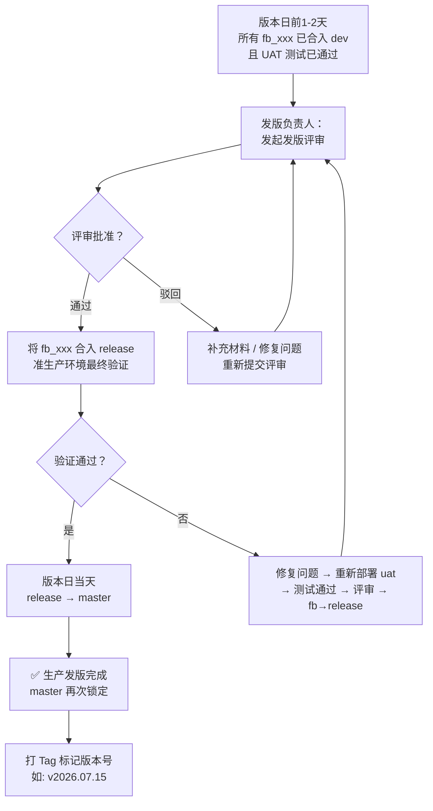

### 7.3 开发者在发版日前后要注意什么

| 时间点 | 你应该做什么 | 不应该做什么 |
|--------|-------------|-------------|
| **版本窗口内（1-12日）** | 开发 fb_xxx，及时提 PR 到 dev | 不要拖到最后一刻 |
| **版本窗口关闭前（13-14日）** | 确保自己的 PR 已合并到 dev | **不要再提新 PR** |
| **版本日（15日）** | 关注发版结果，待命修复 | 不要再 push 到 dev |
| **版本日之后（16日起）** | 从新 master 检出下一个 fb_xxx | 不要从旧 master 检出 |

---

## 八、修改提交信息

### 8.1 修改最近一次提交

**场景：** 提交信息写错了，或漏了一个 SQL 文件。

| 场景 | 操作 |
|------|------|
| **只改提交信息** | 命令面板 → `Git: Commit (Amend)` → 修改信息 → `Ctrl+Enter` |
| **漏了文件** | 先暂存漏掉的 SQL → 再执行 Amend |
| **已 Push 到远程** | Amend 后 `Git: Push (Force)` ⚠️ |

> ⚠️ **Force Push 只在你自己一个人的 fb_xxx 分支上用！** 绝对不要对 `dev`、`uat`、`release`、`master` 用！

---

## 九、回退操作

### 9.1 三种回退对比

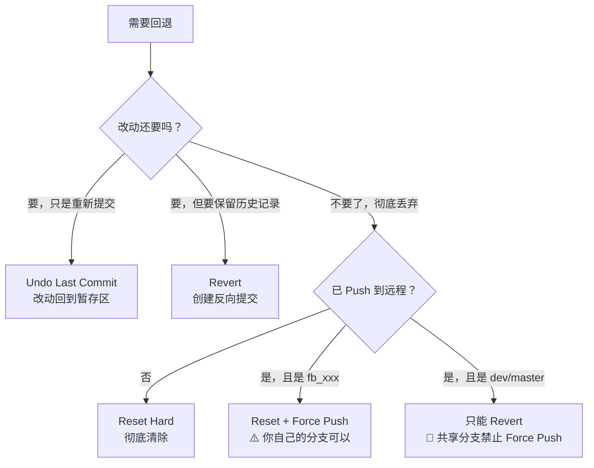

### 9.2 具体操作

**Undo Last Commit：** 命令面板 → `Git: Undo Last Commit`

**Revert（撤销某次提交）：** 命令面板 → `Git: Revert Commit...` → 选择要撤销的提交

**Reset 到某个版本：** 命令面板 → `Git: Reset...` → 选择模式
- `Soft`：保留暂存区和工作区
- `Mixed`：保留工作区（默认）
- `Hard`：全部丢弃 🔴

### 9.3 ETL 特殊场景：发版后发现 SQL 有问题

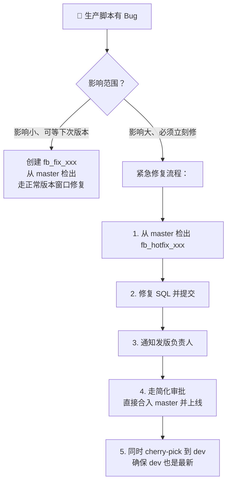

---

## 十、冲突解决——SQL 脚本冲突实战

### 10.1 ETL 仓库冲突的常见场景

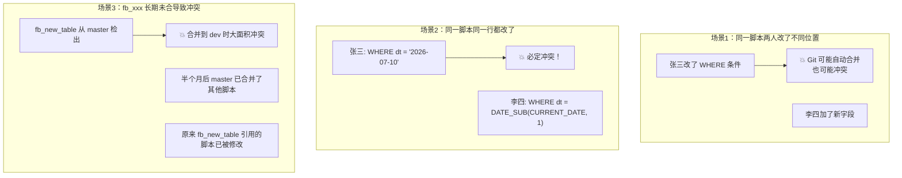

### 10.2 VS Code 解决冲突实战

当你提 PR 到 dev 或 Pull 最新 dev 时，如果出现冲突：

```
┌──────────────────────────────────────┐
│  合并更改 (Merge Changes)             │
├──────────────────────────────────────┤
│  C  dwd_order_inc.sql                │  ← 冲突文件！
│  M  dim_date.sql                     │  ← 正常修改
│  M  dws_cust_sum.sql                 │  ← 正常修改
└──────────────────────────────────────┘
```

点击冲突文件，VS Code 显示内联对比：

```sql
-- dwd_order_inc.sql 冲突示例
INSERT OVERWRITE TABLE dwd_order_inc
SELECT
    order_id,
<<<<<<< HEAD (dev 分支当前的版本)
    order_amount / 100 AS order_amount_yuan   -- 张三：转成元
=======
    order_amount * 0.01 AS order_amount_yuan  -- 你：乘以0.01
>>>>>>> fb_new_cust (你的分支)
    order_time
FROM ods_order;
```

**解决步骤：**

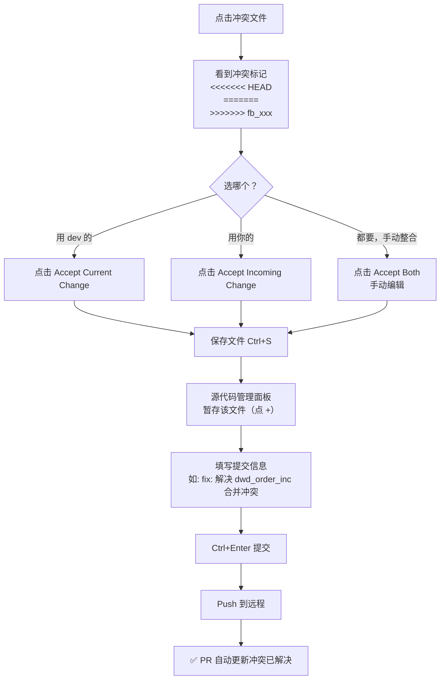

### 10.3 减少冲突的最佳实践

| 实践 | 说明 |
|------|------|
| **一个 fb_xxx 只做一件事** | 不要一个分支又改抽取又改建表 |
| **及时合入 dev** | 不要攒半个月才提 PR |
| **每天同步 dev** | 在你的 fb_xxx 上 `git merge dev` 保持同步 |
| **避免改别人的脚本** | 如果有依赖，先去沟通 |
| **SQL 格式化统一** | 团队统一用 VS Code SQL 格式化插件 |

---

## 十一、进阶操作

### 11.1 保持 fb_xxx 与 dev 同步

当你开发周期较长，dev 已经被别人的 PR 更新了。定期同步避免最终合并时大冲突：

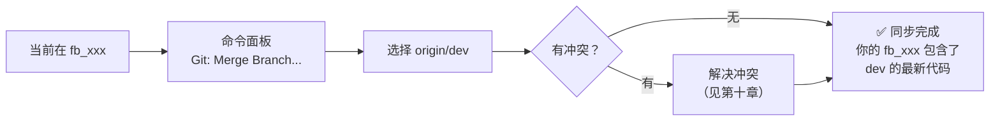

### 11.2 Stash——暂存写到一半的 SQL

**场景：** SQL 写了一半还没法提交，突然需要切分支。

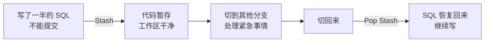

- **暂存：** 命令面板 → `Git: Stash`
- **恢复：** 命令面板 → `Git: Pop Stash`
- **带未跟踪文件：** `Git: Stash (Include Untracked)`

### 11.3 Cherry Pick——只"摘"某次提交

**场景：** 你在 fb_A 写了一个通用日期函数，fb_B 也需要，但不想合并整个分支。

命令面板 → `Git: Cherry Pick...` → 选择目标提交 → 复制到当前分支

### 11.4 查看 SQL 文件的修改历史

1. 在文件资源管理器中右键 `.sql` 文件
2. 选择 `Open Timeline`
3. 底部显示该文件的所有 Git 提交记录

推荐安装 **GitLens** 插件——鼠标悬停在 SQL 行上直接显示作者和时间。

---

## 十二、常见问题与排查

### Q1: 忘记从 master 检出，从 dev 检出了 fb_xxx 怎么办？

**影响：** 你的分支基线不对，包含了 dev 上其他未上线的脚本。

**解决：**
```bash
# 在 fb_xxx 分支上执行
git rebase --onto master dev fb_xxx
# 将你的提交从 dev 基线移到 master 基线上
```

如果操作困难，**最稳妥：** 删除分支，从 master 重新检出，手动复制 SQL 过来。

### Q2: fb_xxx 基于旧 master，版本日后 master 已更新？

```bash
# 在 fb_xxx 分支上
git fetch origin
git merge origin/master
# 解决可能的冲突
```

或在 VS Code 中：命令面板 → `Git: Merge Branch...` → 选择 `origin/master`

### Q3: PR 被退回要求修改怎么办？

直接在 `fb_xxx` 分支上继续改 → Stage → Commit → Push，PR 自动更新，**无需重新创建**。

### Q4: 想放弃 fb_xxx 上的所有改动，重新开始

```bash
git fetch origin
git checkout master
git branch -D fb_xxx          # 删除本地分支
git checkout -b fb_new_name   # 重新从 master 创建
```

### Q5: Push 被拒绝 "rejected, non-fast-forward"

说明远程分支有你本地没有的新提交。先 `Pull` → 解决冲突 → 再 `Push`。

### Q6: 不小心在 dev 分支上改了文件

1. `Git: Stash` 暂存改动
2. 切换到正确的 `fb_xxx` 分支
3. `Git: Pop Stash` 恢复改动

### Q7: 版本窗口关闭前 PR 还没合入

**黄金规则：不要事后补救，要事前沟通。**
- 如果改动不大，联系 Reviewer 加急
- 如果改动大且来不及，通知发版负责人，移入下个版本窗口
- **永远不要**在版本日前一天催着合入未经充分测试的脚本

### Q8: 多个 fb_xxx 之间有依赖关系怎么办？

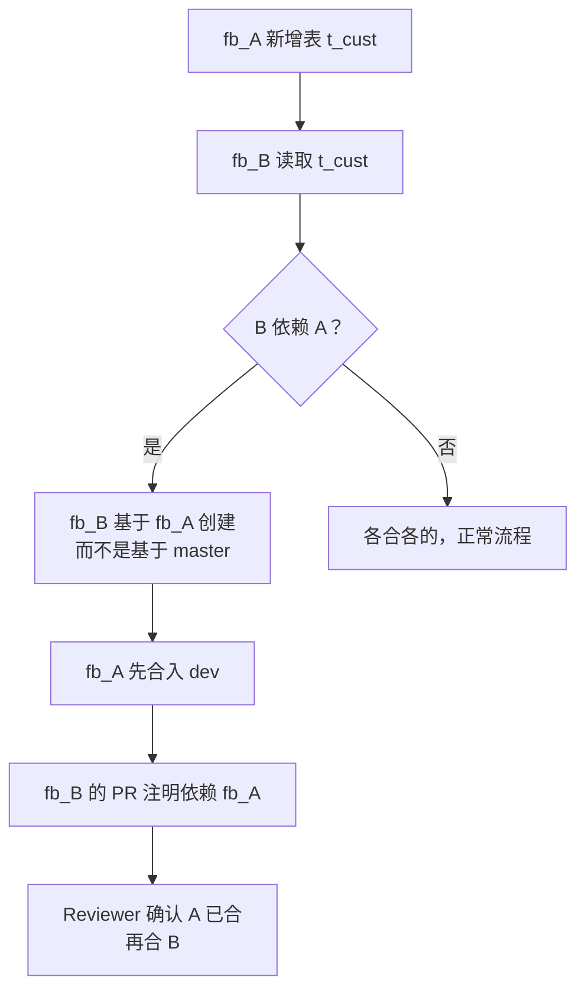

### Q9: 发版后发现 SQL 有问题，但下一个版本窗口还有 10 天？

参照 **9.3 节紧急修复流程**，从 master 检出 `fb_hotfix_xxx`，走简化审批快速上线。

### Q10: dev 上有未通过测试的脚本被误合入，影响其他人的测试？

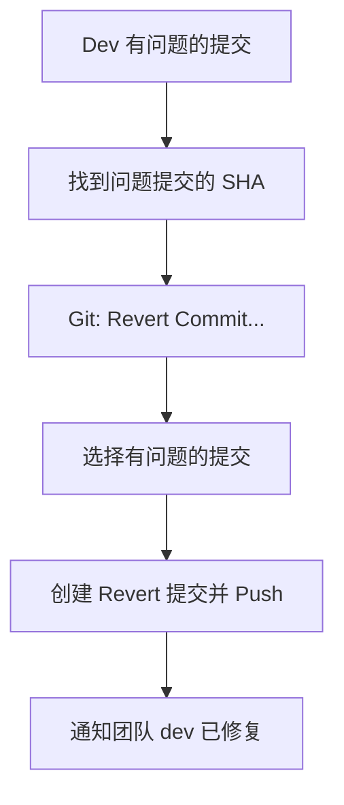

---

## 十三、命令速查表

| 操作 | VS Code 操作 | 命令面板关键词 |
|------|-------------|---------------|
| 克隆仓库 | `F1` 打开面板 | `Git: Clone` |
| 从 master 创建 fb_xxx | 左下角分支名 → 新分支 | `Git: Create Branch` |
| 暂存文件 | 点击文件旁的 `+` | - |
| 提交 | `Ctrl+Enter` | - |
| 推送 | 底部状态栏 `↕️` | `Git: Push` |
| 拉取 | 底部状态栏 `↕️` | `Git: Pull` |
| 同步 dev | - | `Git: Merge Branch...` |
| 撤销最近提交 | - | `Git: Undo Last Commit` |
| 撤销某次提交 | - | `Git: Revert Commit...` |
| 回退到某版本 | - | `Git: Reset...` |
| 暂存当前工作 | - | `Git: Stash` |
| 恢复暂存 | - | `Git: Pop Stash` |
| 摘取提交 | - | `Git: Cherry Pick...` |
| 删除分支 | - | `Git: Delete Branch...` |
| 查看历史 | 安装 GitLens | `Git: View Git Graph` |

---

## 十四、总结

### 14.1 每日核心口诀

> **Master 检出 → fb_xxx 开发 → Push → 双人评审 → PR 合入 dev（开发完成）→ 测试发版人 fb→uat → 测试验证 → 发版评审批准 → fb_xxx 合入 release → 生产发版 release→master → 新一轮开发**

### 14.2 整体流程图

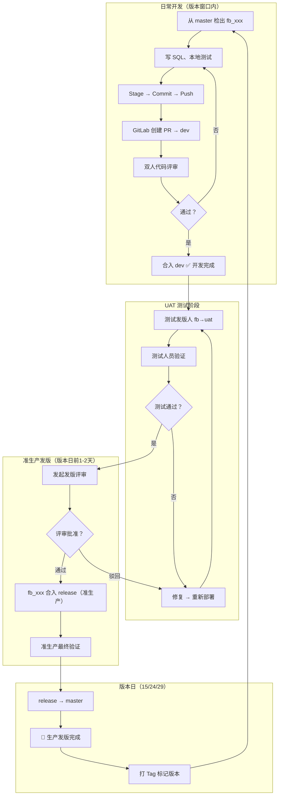

### 14.3 一句话记住各分支

| 分支 | 一句话 |
|------|--------|
| **master** | 生产的镜子，非版本日碰都别碰 |
| **fb_xxx** | 你的工作台，从 master 来，PR 合入 dev 即开发完成 |
| **dev** | 代码审查站，PR 合入即开发完成，不参与后续部署 |
| **uat** | 测试练兵场，发版人将 fb_xxx 部署到 uat，测试人验证 |
| **release** | 发版前的最后一道安检 |

### 14.4 最核心的几条铁律

1. **永远从 master 检出**，不是 dev
2. **永远通过 PR 合入 dev**，不在本地直接 merge
3. **不要在版本窗口关闭前抢合**未测试的脚本
4. **每天同步 dev**到你的 fb_xxx，减少最终冲突
5. **一个 fb_xxx 只做一件事**，方便 Review 和回退
6. **生产出问题走紧急修复流程**，不要在 master 上直接改
7. **Push 前看清分支名**，绝不误推到 master/dev/uat/release
